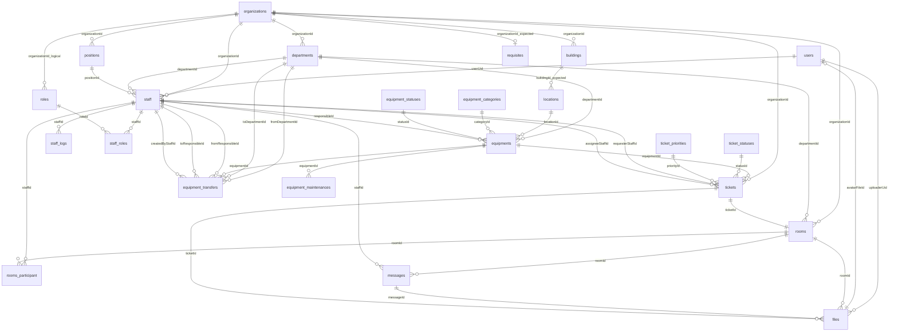

# Database Schema

Источник: Sequelize-модели в `src/database/models`, ассоциации из `src/database/index.ts`, фактические read-model из `src/services`.

## Общая картина

- СУБД: MySQL
- ORM: Sequelize
- Основные домены: users, staff, organizations, locations, equipment, chat, tickets, files
- Soft delete (`paranoid: true`): `users`, `staff`, `organizations`, `departments`, `positions`, `equipments`, `equipment-maintenances`, `messages`, `files`, `tickets`

## Полная схема таблиц

### `users`

| Поле           | Тип        | Null | Ключи / примечание |
| -------------- | ---------- | ---: | ------------------ |
| `uid`          | UUID       |   no | PK                 |
| `login`        | string(64) |   no | unique, email      |
| `phone`        | string(10) |  yes |                    |
| `password`     | string(64) |   no |                    |
| `firstName`    | string(64) |   no |                    |
| `lastName`     | string(64) |   no |                    |
| `surname`      | string(64) |  yes |                    |
| `avatarFileId` | UUID       |  yes | FK -> `files.id`   |
| `createdAt`    | datetime   |   no | auto               |
| `updatedAt`    | datetime   |   no | auto               |
| `deletedAt`    | datetime   |  yes | soft delete        |

Связи:

- `users.uid` 1:N `staff.userUid`
- `users.uid` 1:N `files.uploaderUid`
- `users.avatarFileId` N:1 `files.id`

### `roles`

| Поле             | Тип        | Null | Ключи / примечание                  |
| ---------------- | ---------- | ---: | ----------------------------------- |
| `id`             | int        |   no | PK, AI                              |
| `name`           | string(64) |   no |                                     |
| `description`    | text       |  yes |                                     |
| `organizationId` | int        |   no | логический FK -> `organizations.id` |

Связи:

- `roles.id` 1:N `staff-roles.roleId`
- `roles` N:M `staff` через `staff-roles`

### `staff-roles`

| Поле        | Тип      | Null | Ключи / примечание |
| ----------- | -------- | ---: | ------------------ |
| `id`        | int      |   no | PK, AI             |
| `staffId`   | int      |   no | FK -> `staff.id`   |
| `roleId`    | int      |   no | FK -> `roles.id`   |
| `createdAt` | datetime |   no | auto               |
| `updatedAt` | datetime |   no | auto               |

### `staff`

| Поле             | Тип      | Null | Ключи / примечание       |
| ---------------- | -------- | ---: | ------------------------ |
| `id`             | int      |   no | PK, AI                   |
| `userUid`        | UUID     |   no | FK -> `users.uid`        |
| `organizationId` | int      |  yes | FK -> `organizations.id` |
| `departmentId`   | int      |  yes | FK -> `departments.id`   |
| `positionId`     | int      |  yes | FK -> `positions.id`     |
| `createdAt`      | datetime |   no | auto                     |
| `updatedAt`      | datetime |   no | auto                     |
| `deletedAt`      | datetime |  yes | soft delete              |

Связи:

- `staff.organizationId` N:1 `organizations.id`
- `staff.departmentId` N:1 `departments.id`
- `staff.positionId` N:1 `positions.id`
- `staff` N:M `roles` через `staff-roles`
- `staff` N:M `rooms` через `rooms-participant`
- `staff.id` 1:N `equipments.responsibleId`
- `staff.id` 1:N `tickets.requesterStaffId`
- `staff.id` 1:N `tickets.assigneeStaffId`
- `staff.id` 1:N `messages.staffId`

### `staff-logs`

| Поле        | Тип      | Null | Ключи / примечание          |
| ----------- | -------- | ---: | --------------------------- |
| `id`        | int      |   no | PK, AI                      |
| `message`   | text     |   no |                             |
| `createdAt` | datetime |  yes | default now                 |
| `staffId`   | int      |   no | FK -> `staff.id`            |
| `creatorId` | int      |   no | логический FK -> `staff.id` |
| `updatedAt` | datetime |   no | auto Sequelize              |

Связи:

- `staff-logs.staffId` N:1 `staff.id`
- `creatorId` в модели хранится, но отдельная ассоциация не объявлена

### `organizations`

| Поле        | Тип        | Null | Ключи / примечание |
| ----------- | ---------- | ---: | ------------------ |
| `id`        | int        |   no | PK, AI             |
| `shortName` | string     |   no |                    |
| `fullName`  | mediumtext |   no |                    |
| `createdAt` | datetime   |   no | auto               |
| `updatedAt` | datetime   |   no | auto               |
| `deletedAt` | datetime   |  yes | soft delete        |

Связи:

- `organizations.id` 1:N `departments.organizationId`
- `organizations.id` 1:N `positions.organizationId`
- `organizations.id` 1:N `staff.organizationId`
- `organizations.id` 1:N `buildings.organizationId`
- `organizations.id` 1:N `tickets.organizationId`
- `organizations.id` 1:N `rooms.organizationId`
- логически 1:N `roles.organizationId`
- в коде ожидается 1:1 `requisites.organizationId`

### `departments`

| Поле             | Тип        | Null | Ключи / примечание       |
| ---------------- | ---------- | ---: | ------------------------ |
| `id`             | int        |   no | PK, AI                   |
| `shortName`      | string     |   no |                          |
| `fullName`       | mediumtext |   no |                          |
| `organizationId` | int        |   no | FK -> `organizations.id` |
| `createdAt`      | datetime   |   no | auto                     |
| `updatedAt`      | datetime   |   no | auto                     |
| `deletedAt`      | datetime   |  yes | soft delete              |

### `positions`

| Поле             | Тип        | Null | Ключи / примечание       |
| ---------------- | ---------- | ---: | ------------------------ |
| `id`             | int        |   no | PK, AI                   |
| `shortName`      | string     |   no |                          |
| `fullName`       | mediumtext |   no |                          |
| `organizationId` | int        |   no | FK -> `organizations.id` |
| `createdAt`      | datetime   |   no | auto                     |
| `updatedAt`      | datetime   |   no | auto                     |
| `deletedAt`      | datetime   |  yes | soft delete              |

### `requisites`

| Поле             | Тип        | Null | Ключи / примечание       |
| ---------------- | ---------- | ---: | ------------------------ |
| `id`             | int        |   no | PK, AI                   |
| `kpp`            | string(64) |  yes |                          |
| `inn`            | string(64) |  yes |                          |
| `oktmo`          | string(64) |  yes |                          |
| `organizationId` | int        |   no | FK -> `organizations.id` |
| `createdAt`      | datetime   |   no | auto Sequelize           |
| `updatedAt`      | datetime   |   no | auto Sequelize           |

Комментарий:

- В сервисах/ассоциациях используется как 1:1 с `organizations`, но уникальность на `organizationId` не задана.

### `buildings`

| Поле      | Тип         | Null | Ключи / примечание |
| --------- | ----------- | ---: | ------------------ |
| `id`      | int         |   no | PK, AI             |
| `name`    | string(256) |   no |                    |
| `address` | string(256) |   no |                    |

Ожидаемая связь:

- `organizationId` должен быть FK -> `organizations.id`

Факт:

- поле `organizationId` объявлено в типе модели и активно используется сервисами, но в `init()` отсутствует

### `locations`

| Поле   | Тип         | Null | Ключи / примечание |
| ------ | ----------- | ---: | ------------------ |
| `id`   | int         |   no | PK, AI             |
| `name` | string(256) |   no |                    |

Ожидаемая связь:

- `buildingId` должен быть FK -> `buildings.id`

Факт:

- поле `buildingId` объявлено в типе модели и используется ассоциацией/сервисами, но в `init()` отсутствует

### `equipment-categories`

| Поле   | Тип         | Null | Ключи / примечание |
| ------ | ----------- | ---: | ------------------ |
| `id`   | int         |   no | PK, AI             |
| `name` | string(128) |   no |                    |

Связи:

- `equipment-categories.id` 1:N `equipments.categoryId`

### `equipment-statuses`

| Поле   | Тип         | Null | Ключи / примечание |
| ------ | ----------- | ---: | ------------------ |
| `id`   | int         |   no | PK, AI             |
| `name` | string(128) |   no |                    |

Связи:

- `equipment-statuses.id` 1:N `equipments.statusId`

### `equipments`

| Поле              | Тип         | Null | Ключи / примечание              |
| ----------------- | ----------- | ---: | ------------------------------- |
| `id`              | int         |   no | PK, AI                          |
| `name`            | string(128) |   no |                                 |
| `serialNumber`    | string(64)  |   no |                                 |
| `inventoryNumber` | string(64)  |   no |                                 |
| `categoryId`      | int         |   no | FK -> `equipment-categories.id` |
| `statusId`        | int         |   no | FK -> `equipment-statuses.id`   |
| `locationId`      | int         |   no | ожидаемый FK -> `locations.id`  |
| `departmentId`    | int         |  yes | FK -> `departments.id`          |
| `responsibleId`   | int         |  yes | FK -> `staff.id`                |
| `createdAt`       | datetime    |   no | auto                            |
| `updatedAt`       | datetime    |   no | auto                            |
| `deletedAt`       | datetime    |  yes | soft delete                     |

Связи:

- `equipments.departmentId` N:1 `departments.id`
- `equipments.id` 1:N `equipment-maintenances.equipmentId`
- `equipments.id` 1:N `equipment-transfers.equipmentId`
- `equipments.id` 1:N `tickets.equipmentId`

### `equipment-maintenances`

| Поле          | Тип      | Null | Ключи / примечание    |
| ------------- | -------- | ---: | --------------------- |
| `id`          | int      |   no | PK, AI                |
| `last`        | date     |  yes |                       |
| `next`        | date     |  yes |                       |
| `equipmentId` | int      |   no | FK -> `equipments.id` |
| `createdAt`   | datetime |   no | auto                  |
| `updatedAt`   | datetime |   no | auto                  |
| `deletedAt`   | datetime |  yes | soft delete           |

### `equipment-transfers`

| Поле                | Тип      | Null | Ключи / примечание        |
| ------------------- | -------- | ---: | ------------------------- |
| `id`                | int      |   no | PK, AI                    |
| `transferDate`      | datetime |   no | дата фактической передачи |
| `comment`           | text     |  yes | комментарий к передаче    |
| `equipmentId`       | int      |   no | FK -> `equipments.id`     |
| `fromResponsibleId` | int      |  yes | FK -> `staff.id`          |
| `toResponsibleId`   | int      |  yes | FK -> `staff.id`          |
| `fromDepartmentId`  | int      |  yes | FK -> `departments.id`    |
| `toDepartmentId`    | int      |  yes | FK -> `departments.id`    |
| `createdByStaffId`  | int      |   no | FK -> `staff.id`          |
| `createdAt`         | datetime |   no | auto                      |
| `updatedAt`         | datetime |   no | auto                      |

### `rooms`

| Поле             | Тип    | Null | Ключи / примечание                                                   |
| ---------------- | ------ | ---: | -------------------------------------------------------------------- |
| `id`             | UUID   |   no | PK                                                                   |
| `type`           | enum   |   no | `global`, `organization`, `department`, `group`, `private`, `ticket` |
| `name`           | string |  yes |                                                                      |
| `organizationId` | int    |  yes | FK -> `organizations.id`                                             |
| `departmentId`   | int    |  yes | FK -> `departments.id`                                               |
| `ticketId`       | int    |  yes | FK -> `tickets.id`                                                   |

Связи:

- `rooms` N:M `staff` через `rooms-participant`
- `rooms.id` 1:N `messages.roomId`
- `rooms.id` 1:N `files.roomId`

### `rooms-participant`

| Поле      | Тип  | Null | Ключи / примечание |
| --------- | ---- | ---: | ------------------ |
| `id`      | UUID |   no | PK                 |
| `staffId` | int  |   no | FK -> `staff.id`   |
| `roomId`  | UUID |   no | FK -> `rooms.id`   |

### `messages`

| Поле        | Тип      | Null | Ключи / примечание |
| ----------- | -------- | ---: | ------------------ |
| `id`        | UUID     |   no | PK                 |
| `content`   | text     |   no |                    |
| `roomId`    | UUID     |   no | FK -> `rooms.id`   |
| `staffId`   | int      |   no | FK -> `staff.id`   |
| `createdAt` | datetime |   no | auto               |
| `updatedAt` | datetime |   no | auto               |
| `deletedAt` | datetime |  yes | soft delete        |

### `files`

| Поле           | Тип         | Null | Ключи / примечание  |
| -------------- | ----------- | ---: | ------------------- |
| `id`           | UUID        |   no | PK                  |
| `kind`         | enum        |   no | `chat`, `avatar`    |
| `originalName` | string(255) |   no |                     |
| `mimeType`     | string(128) |   no |                     |
| `size`         | int         |   no |                     |
| `originalPath` | string(512) |   no |                     |
| `hiPath`       | string(512) |   no |                     |
| `normPath`     | string(512) |   no |                     |
| `lowPath`      | string(512) |   no |                     |
| `roomId`       | UUID        |  yes | FK -> `rooms.id`    |
| `ticketId`     | int         |  yes | FK -> `tickets.id`  |
| `messageId`    | UUID        |  yes | FK -> `messages.id` |
| `uploaderUid`  | UUID        |   no | FK -> `users.uid`   |
| `createdAt`    | datetime    |   no | auto                |
| `updatedAt`    | datetime    |   no | auto                |
| `deletedAt`    | datetime    |  yes | soft delete         |

### `ticket-statuses`

| Поле    | Тип         | Null | Ключи / примечание |
| ------- | ----------- | ---: | ------------------ |
| `id`    | int         |   no | PK, AI             |
| `name`  | string(64)  |   no | unique             |
| `label` | string(128) |   no |                    |

### `ticket-priorities`

| Поле    | Тип         | Null | Ключи / примечание |
| ------- | ----------- | ---: | ------------------ |
| `id`    | int         |   no | PK, AI             |
| `name`  | string(64)  |   no | unique             |
| `label` | string(128) |   no |                    |

### `tickets`

| Поле               | Тип         | Null | Ключи / примечание           |
| ------------------ | ----------- | ---: | ---------------------------- |
| `id`               | int         |   no | PK, AI                       |
| `title`            | string(256) |   no |                              |
| `description`      | text        |   no |                              |
| `adminComment`     | text        |  yes |                              |
| `rejectReason`     | text        |  yes |                              |
| `completedAt`      | datetime    |  yes |                              |
| `organizationId`   | int         |   no | FK -> `organizations.id`     |
| `equipmentId`      | int         |  yes | FK -> `equipments.id`        |
| `requesterStaffId` | int         |   no | FK -> `staff.id`             |
| `assigneeStaffId`  | int         |  yes | FK -> `staff.id`             |
| `statusId`         | int         |   no | FK -> `ticket-statuses.id`   |
| `priorityId`       | int         |   no | FK -> `ticket-priorities.id` |
| `createdAt`        | datetime    |   no | auto                         |
| `updatedAt`        | datetime    |   no | auto                         |
| `deletedAt`        | datetime    |  yes | soft delete                  |

Связи:

- `tickets.id` 1:1 `rooms.ticketId`
- `tickets.id` 1:N `files.ticketId`

## ER-связи

## Что реально видит фронт через API

По сервисам фронт получает не только голые таблицы, но и вложенные связи:

- `organization/get`: `requisites`, `departments`, `positions`, `staff`, `buildings`
- `department/list|get`: включает `organization`
- `staff/list|get`: включает `user`, `organization`, `department`, `position`, `roles`
- `equipment/list|get`: включает `category`, `status`, `location`, `department`, `responsible`, а для `get` еще `maintenances` и `transfers`
- `equipment/transfer/list`: возвращает историю передач с `from*`, `to*`, `createdBy`, `equipment`
- `ticket/list|get`: включает `organization`, `equipment`, `requester`, `assignee`, `status`, `priority`, `room`
- `chat/room/get`: включает `staffs`, `messages.sender`
- `chat/message/list` и `ticket/chat/messages`: включают `sender`

## Расхождения и риски для фронта

### Критичные

1. `buildings.organizationId` отсутствует в `init()`

   - Модель и сервисы считают, что поле есть, но в определении таблицы его нет.
   - Следствие: фильтрация зданий по организации и вложенные include по `organizationId` будут нестабильны или сломаются.

2. `locations.buildingId` отсутствует в `init()`

   - Ассоциация `location -> building` объявлена, но колонка не описана.
   - Следствие: `equipment.location.building`, выборки по локациям и проверка принадлежности оборудования организации ломаются.

3. Цепочка `ticket -> equipment -> location -> building -> organization` используется для ACL и выборок
   - Это есть в сервисе тикетов и оборудования.
   - Если два поля выше реально не заведены в БД, фронт получит пустые/битые данные по оборудованию и тикетам.

### Средние

4. `organizations.hasOne(requisites)` не обеспечено уникальным индексом

   - Контракт и сервис читают реквизиты как одну запись, но таблица допускает несколько строк на организацию.
   - Следствие: фронт ожидает объект `requisites`, а фактически данные могут стать неоднозначными.

5. `roles.organizationId` есть в данных, но ассоциация `Role -> Organization` не объявлена

   - Для полного read-model фронту нельзя штатно получить роль вместе с организацией через include.

6. `staff-logs.creatorId` не оформлен как ассоциация

   - Фронт не сможет штатно получить автора записи журнала как вложенный объект.

7. В контрактах создания тикета указаны опциональные `requesterStaffId`, `statusId`, `priorityId`, но сервис игнорирует `requesterStaffId`
   - Фактически `requesterStaffId` всегда берется из JWT `actor.staffId`.
   - Если фронт отправляет это поле и ожидает, что сервер его сохранит, это ложное ожидание.

### Низкие, но заметные

8. `buildings` и `locations` работают без `timestamps`, остальные бизнес-сущности в основном с ними

   - Если фронт строит универсальные таблицы по `createdAt/updatedAt`, эти сущности выбиваются.

9. `files` допускает одновременно `roomId`, `ticketId`, `messageId`

   - Контракт не фиксирует строгую взаимоисключаемость.
   - Для фронта это значит, что тип привязки файла надо определять аккуратно, не по одному полю.

10. В `chat/room/get` сообщения вложены в room, а в `chat/message/list` и `ticket/chat/messages` они приходят отдельным списком

- Это не ошибка схемы БД, но это реальное расхождение формы ответа, которое фронту надо учитывать.

## Минимальный список того, что стоит сверить с фронтом

- Ожидает ли фронт у `building` поле `organizationId`
- Ожидает ли фронт у `location` поле `buildingId`
- Использует ли фронт `equipment.location.building`
- Передает ли фронт `requesterStaffId` в `ticket/create` и рассчитывает ли, что сервер его уважает
- Считает ли фронт `organization.requisites` строго одним объектом
- Ожидает ли фронт timestamps у `buildings` и `locations`
